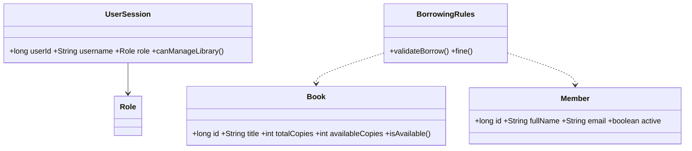
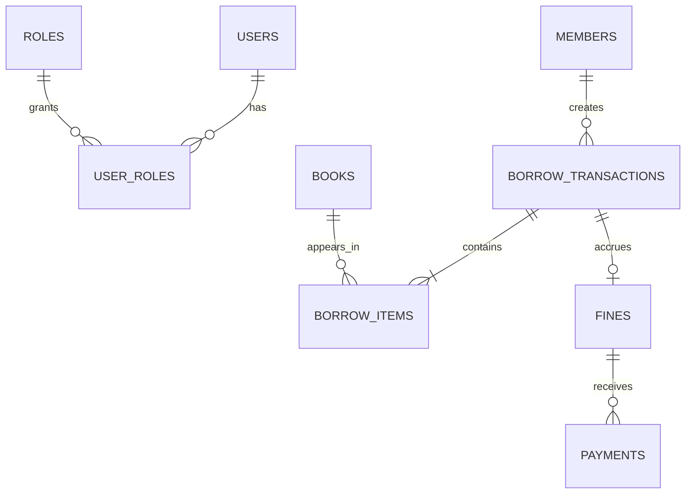

# UML and ER diagrams

```mermaid
classDiagram
    class UserSession { +long userId +String username +Role role +canManageLibrary() }
    class Book { +long id +String title +int totalCopies +int availableCopies +isAvailable() }
    class Member { +long id +String fullName +String email +boolean active }
    class BorrowingRules { +validateBorrow() +fine() }
    UserSession --> Role
    BorrowingRules ..> Book
    BorrowingRules ..> Member
```

```mermaid
erDiagram
    USERS ||--o{ USER_ROLES : has
    ROLES ||--o{ USER_ROLES : grants
    MEMBERS ||--o{ BORROW_TRANSACTIONS : creates
    BORROW_TRANSACTIONS ||--|{ BORROW_ITEMS : contains
    BOOKS ||--o{ BORROW_ITEMS : appears_in
    BORROW_TRANSACTIONS ||--o| FINES : accrues
    FINES ||--o{ PAYMENTS : receives
```
